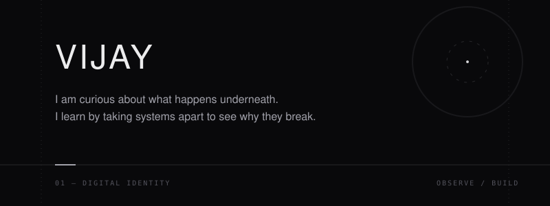
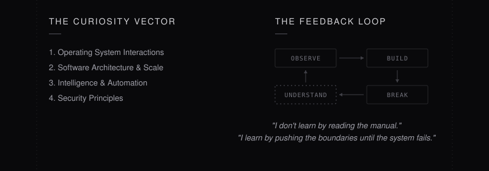
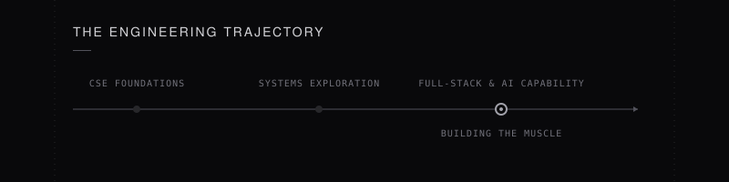

  <picture>
    <source media="(prefers-color-scheme: dark)" srcset="assets/identity-core.svg">
    <source media="(prefers-color-scheme: light)" srcset="assets/identity-core.svg">
    
  </picture>

  <table width="800" border="0" cellpadding="0" cellspacing="0">
    <tr>
      <td width="60"></td>
      <td width="680">
          
        <h3 align="left">A Little About Me</h3>
        
I am a Computer Science student, but my identity is not my degree. I am someone who fundamentally enjoys taking things apart. If a system feels like magic, it bothers me until I figure out the illusion. I am currently spending my time outside of class growing into a serious software engineer by building things that force me to look underneath the abstraction layers.

         
      </td>
      <td width="60"></td>
    </tr>
  </table>

  <picture>
    <source media="(prefers-color-scheme: dark)" srcset="assets/mind-map.svg">
    <source media="(prefers-color-scheme: light)" srcset="assets/mind-map.svg">
    
  </picture>

  <picture>
    <source media="(prefers-color-scheme: dark)" srcset="assets/trajectory.svg">
    <source media="(prefers-color-scheme: light)" srcset="assets/trajectory.svg">
    
  </picture>

  <table width="800" border="0" cellpadding="0" cellspacing="0">
    <tr>
      <td width="60"></td>
      <td width="680">
          
        <h3 align="left">Personal Principles</h3>
        

          <b>Understand before pretending to know.</b> I would rather admit ignorance and write terrible code to test a concept than use a framework blindly.  
          <b>Don't hide complexity — map it.</b> The best engineering doesn't pretend complexity doesn't exist; it just organizes it beautifully.  
          <b>Build to understand.</b> The fastest way for me to comprehend a concept is to see it fail in practice.
        

          
        

          <i>— I leave the repositories below to prove the rest.</i>
        

          
      </td>
      <td width="60"></td>
    </tr>
  </table>

