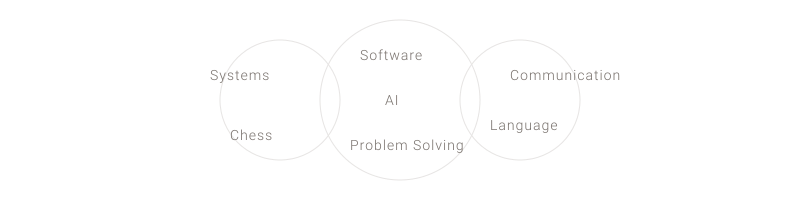

  <picture>
    <source media="(prefers-color-scheme: dark)" srcset="assets/hero.svg">
    <source media="(prefers-color-scheme: light)" srcset="assets/hero.svg">
    
  </picture>

  

  <table width="600" border="0" cellspacing="0" cellpadding="0">
    <tr>
      <td>
        <h3 align="left" style="font-weight: 400; color: #78716c;">About Me</h3>
        

          I am a Computer Science student, but my time inside a classroom is only a small part of how I learn. Mostly, I am someone whose curiosity tends to get the better of them. I enjoy finding systems that I don't understand and slowly taking them apart until they make sense.
        

        

          I believe that the best way to understand technology is to experiment with it. When things break, fail, or behave unexpectedly, I don't see it as a roadblock—I see it as the moment real learning finally begins.
        

          
        
        <h3 align="left" style="font-weight: 400; color: #78716c;">Current Direction</h3>
        

          Right now, I am exploring what it means to be a serious software engineer. My focus is shifting between Cyber Security, backend architectures, and local AI systems. I am learning how to structure complex applications and solve problems that require more than just writing a few lines of code.
        

          

        <h3 align="left" style="font-weight: 400; color: #78716c;">Where My Curiosity Drifts</h3>
        

          My interests are scattered, but they all revolve around a single theme: understanding how things connect.
        

      </td>
    </tr>
  </table>

  <picture>
    <source media="(prefers-color-scheme: dark)" srcset="assets/interests.svg">
    <source media="(prefers-color-scheme: light)" srcset="assets/interests.svg">
    
  </picture>

  <table width="600" border="0" cellspacing="0" cellpadding="0">
    <tr>
      <td>
           
        

          <a href="https://vijayaragavanr.vercel.app/" style="text-decoration: none; color: #a8a29e;">Portfolio &rarr;</a>
          &nbsp;&nbsp;&nbsp;&nbsp;&nbsp;&nbsp;&nbsp;
          <a href="mailto:vijay12vasu@gmail.com" style="text-decoration: none; color: #a8a29e;">Email &rarr;</a>
        

          
      </td>
    </tr>
  </table>

