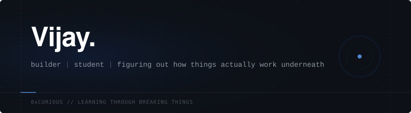

  <picture>
    <source media="(prefers-color-scheme: dark)" srcset="assets/hero-banner.svg">
    <source media="(prefers-color-scheme: light)" srcset="assets/hero-banner.svg">
    
  </picture>

 

### 01 ─ Who I Am

I am a Computer Science student (Cyber Security) who spends most of my time outside of class writing code, breaking things, and trying to understand how software *actually* functions beneath the surface. I’m not pretending to be an expert yet—I am actively growing into a serious software engineer by taking things apart and building them back up.

 

### 02 ─ What Pulls My Curiosity

I am naturally drawn to the intersection of **AI systems, backend engineering, and automation**. Rather than just building simple web apps, I want to understand what happens when code interacts with the operating system, how local AI models can be orchestrated, and how to structure applications securely from the database to the interface.

 

### 03 ─ How I Build

> **BUILD ⟶ BREAK ⟶ UNDERSTAND ⟶ REBUILD**

I learn through friction. If a concept like microservices, spatial UI, or AI context persistence feels too abstract, I write the code to see it fail in practice, trace the errors, figure out why it broke, and rebuild it the right way. I care deeply about the details, the user experience, and the underlying logic of the tools I use.

 

### 04 ─ Currently Exploring

I am focused on turning my curiosity into deep, practical capability. Right now, my trajectory looks like:
- **Full-stack Java development** (building the backend muscle)
- **Data Structures & Algorithms** (learning to think structurally)
- **Local AI experimentation** (bringing intelligence to the host OS)

 

 

### 05 ─ One Thing I'm Proud Of

Instead of listing every repository I've ever made (you can see those in the tabs above), here is one project that captures how I like to think:

<table>
  <tr>
    <td width="100%" valign="top">
      <h3><a href="https://github.com/vijay12vasu/Echo">EchoAI</a></h3>
      <b>The Problem:</b> I wanted an AI assistant that didn't just sit in a browser window, but actually understood my local environment and could automate OS-level tasks.   
      <b>What I Built:</b> An experimental, locally-hosted AI desktop assistant driven by Python and Ollama.   
      <b>What I Learned:</b> How to persist execution context locally, route tasks intelligently, and safely interact with the underlying system rather than just making API calls.
    </td>
  </tr>
</table>

 

 

### 06 ─ Tools I Actually Use

I keep my stack focused on the things I am actively using to build right now.

  
  
  
  
  

 

### 07 ─ Connect

If you want to see how I present my work visually, check out my **[Portfolio](https://vijayaragavanr.vercel.app)**. If you want to talk about systems, code, or opportunities, reach out at **[vijay12vasu@gmail.com](mailto:vijay12vasu@gmail.com)**.

 

  
<i>— learning by building things I don't completely understand yet.</i>

