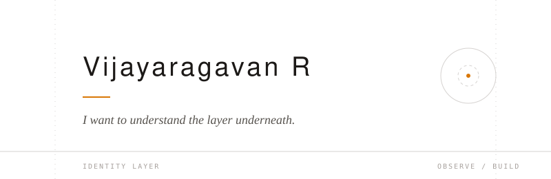
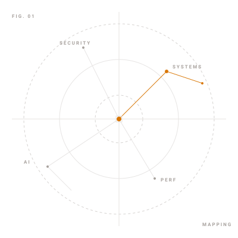
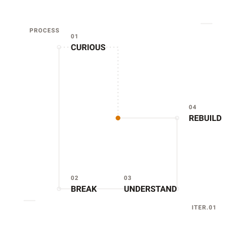

<picture>
<source media="(prefers-color-scheme: dark)" srcset="assets/hero.svg">
<source media="(prefers-color-scheme: light)" srcset="assets/hero.svg">

</picture>

   

<h3 align="left" style="font-family: -apple-system, BlinkMacSystemFont, 'Segoe UI', Roboto, Helvetica, Arial, sans-serif; font-weight: 600; color: #1c1917; font-size: 20px; letter-spacing: -0.3px; margin-top: 0; margin-bottom: 16px;">A Little About Me</h3>

I’m a Computer Science Engineering student focused on becoming a strong software engineer through practical experience. I’m interested in understanding how software works beyond the surface—how systems are designed, how different components interact, and how ideas become reliable, working products.  
I learn best by turning concepts into working systems. Building, testing, breaking, and refining something gives me a deeper understanding than simply studying it in theory.

    

<picture>
<source media="(prefers-color-scheme: dark)" srcset="assets/curiosity.svg">
<source media="(prefers-color-scheme: light)" srcset="assets/curiosity.svg">

</picture>

<h3 align="left" style="font-family: -apple-system, BlinkMacSystemFont, 'Segoe UI', Roboto, Helvetica, Arial, sans-serif; font-weight: 600; color: #1c1917; font-size: 20px; letter-spacing: -0.3px; margin-top: 0; margin-bottom: 16px;">Curiosity</h3>

I’m naturally drawn to the parts of technology that require deeper understanding. I enjoy exploring how software interacts with operating systems, how automation can simplify complex tasks, and how well-structured systems can turn complicated problems into manageable ones.  
My interests continue to evolve, but the underlying goal remains the same: understand how things work, then find better ways to build them.

 
    

<picture>
<source media="(prefers-color-scheme: dark)" srcset="assets/learning.svg">
<source media="(prefers-color-scheme: light)" srcset="assets/learning.svg">

</picture>

<h3 align="right" style="font-family: -apple-system, BlinkMacSystemFont, 'Segoe UI', Roboto, Helvetica, Arial, sans-serif; font-weight: 600; color: #1c1917; font-size: 20px; letter-spacing: -0.3px; margin-top: 0; margin-bottom: 16px;">How I Learn</h3>

I learn through a combination of theory and experimentation. I start with a concept, put it into practice, and use the problems I encounter to understand what I missed.  
Debugging, experimenting, and rebuilding are an important part of that process. When something fails, I prefer to trace the problem to its root rather than work around it. That process helps me turn unfamiliar concepts into knowledge I can actually apply.

 
    

<h3 align="left" style="font-family: -apple-system, BlinkMacSystemFont, 'Segoe UI', Roboto, Helvetica, Arial, sans-serif; font-weight: 600; color: #1c1917; font-size: 20px; letter-spacing: -0.3px; margin-top: 0; margin-bottom: 16px;">Where I'm Heading</h3>

I’m currently building my foundation as a software engineer, with a growing focus on full-stack development, backend systems, and AI-driven software.  
My goal is not simply to learn more technologies, but to become better at designing, understanding, and building complete systems. I’m continuing to strengthen my fundamentals while gaining experience through projects and practical problem-solving.

   

<h3 align="left" style="font-family: -apple-system, BlinkMacSystemFont, 'Segoe UI', Roboto, Helvetica, Arial, sans-serif; font-weight: 600; color: #1c1917; font-size: 20px; letter-spacing: -0.3px; margin-top: 0; margin-bottom: 16px;">Personal Principles</h3>

&bull; <b style="font-weight: 600; color: #1c1917;">Understand before you use.</b> I want to know what a tool or abstraction is doing rather than depending on it without understanding the fundamentals.  
&bull; <b style="font-weight: 600; color: #1c1917;">Build to learn.</b> Working on real systems exposes gaps in my understanding and gives me a reason to close them.  
&bull; <b style="font-weight: 600; color: #1c1917;">Improve through iteration.</b> Good software rarely appears fully formed. I believe meaningful improvement comes from building, testing, identifying weaknesses, and refining the result.

     

<a href="https://vijayaragavanr.vercel.app/" style="text-decoration: none; color: #1c1917;">[ Explore Portfolio &rarr; ]</a>
&nbsp;&nbsp;&nbsp;&nbsp;&nbsp;&nbsp;
<a href="https://www.linkedin.com/in/vijay-vasu/" style="text-decoration: none; color: #78716c;">[ LinkedIn &nearr; ]</a>

A closer look at what I build, how I think, and what I’m currently exploring.

