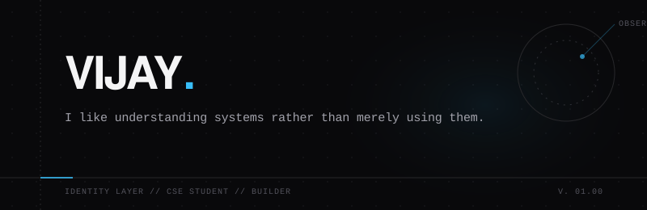
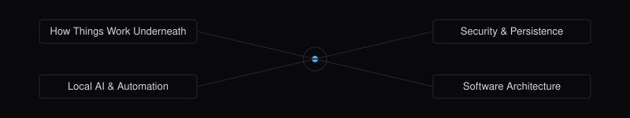

  <picture>
    <source media="(prefers-color-scheme: dark)" srcset="assets/hero-identity.svg">
    <source media="(prefers-color-scheme: light)" srcset="assets/hero-identity.svg">
    
  </picture>

 

## 01 // Who I Am

I am a Computer Science student currently growing into a software engineer. But more than that, I am someone who spends most of my time taking things apart to see how they actually work. I don't just want to write code that runs; I want to understand what happens underneath the abstraction layers. 

I build things that shouldn't be this complicated just to figure out why they are.

 

 

## 02 // What Piques My Curiosity

I am naturally drawn to problems that require looking below the surface.

  <picture>
    <source media="(prefers-color-scheme: dark)" srcset="assets/curiosity-map.svg">
    <source media="(prefers-color-scheme: light)" srcset="assets/curiosity-map.svg">
    
  </picture>

 

 

## 03 // How I Learn

I don't learn by reading documentation from end to end. I learn through friction. I find a concept that feels too abstract, I try to use it, I watch it inevitably break, and then I trace the error all the way down until the system makes sense.

  <picture>
    <source media="(prefers-color-scheme: dark)" srcset="assets/learning-cycle.svg">
    <source media="(prefers-color-scheme: light)" srcset="assets/learning-cycle.svg">
     Try -> Break -> Analyze -> Rebuild -> Curious" src="assets/learning-cycle.svg">
  </picture>

 

 

## 04 // My Trajectory

Right now, I am heavily focused on turning my curiosity into deep, practical capability. I am moving toward full-stack development and systems engineering by focusing on:

- **Deep Backend Foundations:** Understanding state, transactions, and performance in Java.
- **Data Structures & Algorithms:** Learning how to think structurally and solve problems efficiently.
- **Applied Local AI:** Figuring out how intelligence can securely interact with host operating systems rather than just existing in the cloud.

 

 

## 05 // Principles I Build By

*   **Understand Before Abstraction:** Don't use a tool until you at least loosely understand what it's hiding from you.
*   **Build Instead of Consume:** The easiest way to learn a system is to try building a terrible version of it from scratch.
*   **Embrace the Breakage:** Errors aren't failures; they are the fastest way to map the boundaries of a system.

 

 

## 06 // Connect

If you want to talk about how things work, or if you're interested in the things I am exploring, you can reach me at **[vijay12vasu@gmail.com](mailto:vijay12vasu@gmail.com)**.

 

  
<i>— learning by building things I don't completely understand yet.</i>

